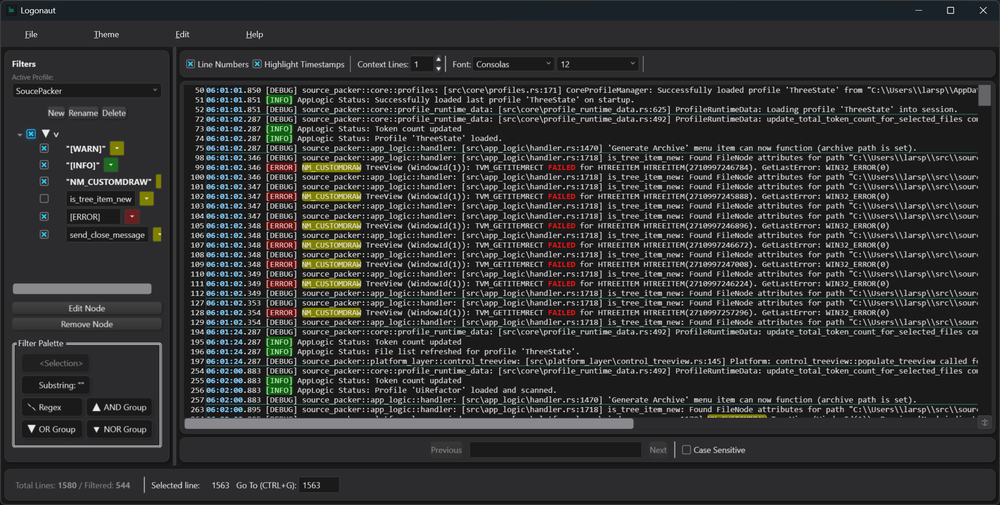

# Logonaut

**Logonaut** is a modern, modular log viewer application for Windows built with C# and WPF. It provides real-time log tailing, advanced filtering capabilities, customizable syntax highlighting, and a clean, responsive user interface with theme support.



## Key Features

*   **Live Log Tailing:** Continuously monitors and displays updates from log files.
*   **Flexible Input:** Open log files or paste content directly from the clipboard.
*   **Advanced Filtering:** Create complex filter rules using substrings, regex, and logical operators (AND/OR/NOR) organized in manageable, named profiles.
*   **Custom Highlighting:** Define syntax highlighting rules for timestamps, log levels, and custom patterns. Filter matches are also highlighted.
*   **Original Line Numbers:** Tracks and displays the original line number for each log entry, even when filtered.
*   **Theming:** Supports Light and Dark themes ("Clinical Neon" and "Neon Night").
*   **Persistence:** Saves user settings, including all defined filter profiles and the last active one.

## Getting Started

### Prerequisites

*   .NET 8 SDK (for building)
*   .NET 8 Desktop Runtime (for running the compiled application)
*   Visual Studio or another compatible IDE/editor (optional, for development)

### Building & Running

1.  Clone the repository.
2.  Build the solution: `dotnet build Logonaut.sln`
3.  Run the UI project: `dotnet run --project src/Logonaut.UI/Logonaut.UI.csproj`

## Running Unit Tests

The solution includes both cross-platform tests and Windows-only UI tests.

* **Core tests** for `Logonaut.Common`, `Logonaut.Core`, `Logonaut.Filters`, and
  `Logonaut.LogTailing` target **.NET 8** and can be executed on any platform:

  ```bash
  dotnet test tests/Logonaut.Common.Tests/Logonaut.Common.Tests.csproj
  dotnet test tests/Logonaut.Core.Tests/Logonaut.Core.Tests.csproj
  dotnet test tests/Logonaut.Filters.Tests/Logonaut.Filters.Tests.csproj
  dotnet test tests/Logonaut.LogTailing.Tests/Logonaut.LogTailing.Tests.csproj
  ```

* **UI tests** (`Logonaut.UI.Tests`) require the **.NET 8 Windows Desktop SDK**
  and can only be run on Windows:

  ```bash
  dotnet test tests/Logonaut.UI.Tests/Logonaut.UI.Tests.csproj
  ```

## Dependencies and Tools

Logonaut utilizes several external libraries and tools:

*   **Core Framework & Libraries:**
    *   **.NET 8 & WPF:** The primary application framework.
    *   **AvalonEdit:** The core text editor control used for log display.
    *   **CommunityToolkit.Mvvm:** Provides helpers for implementing the MVVM pattern.
    *   **System.Reactive (Rx.NET):** Used for reactive programming, particularly in the log filtering pipeline.
    *   **Newtonsoft.Json:** Used for serializing and deserializing settings (like filter profiles) to JSON.
    *   **Microsoft.Xaml.Behaviors.Wpf:** Used for attaching behaviors to UI elements in XAML.

*   **Development & Build Tools:**
    *   **Visual Studio Code / Visual Studio:** Recommended IDEs for development.
    *   **Git:** For version control.
    *   **dotnet CLI:** Used for building, running, and cleaning the solution.

*   **Testing:**
    *   **MSTest (`MSTest.TestAdapter`, `MSTest.TestFramework`):** The unit testing framework.
    *   **Microsoft.NET.Test.Sdk:** Provides MSBuild targets and infrastructure for testing.
    *   **Microsoft.Reactive.Testing:** Provides tools for testing Rx.NET observables (`TestScheduler`).

*   **Installation:**
    *   **Inno Setup:** Used to create the Windows installer package (`LogonautInstaller.iss`, compiled with `iscc`).

*   **Runtime Dependency:**
    *   **.NET 8 Desktop Runtime:** Required on the end-user's machine to run the application if installed via the Inno Setup installer (which doesn't bundle the runtime).

## More Information

*   For detailed user features and requirements, see [UserRequirements.md](doc/UserRequirements.md).
*   For technical design and architecture details, see [ArchitectureAndDesign.md](doc/ArchitectureAndDesign.md).
*   For general software design principles used, see [GeneralDesignPrinciples.md](doc/GeneralDesignPrinciples.md).

## Contributing

Contributions, issues, and feature requests are welcome.

## License

This project is licensed under the MIT License.